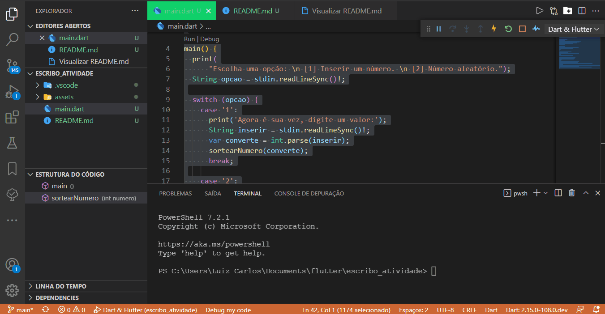

<h1 align="center">Teste Técnico 01</h1>

<p align="center">Esse projeto foi desenvolvido como parte de uma etapa para Seleção de Desenvolvedor de Software. O código possui uma função que recebe um número inteiro positivo e retorna o somatório de todos os valores inteiros divisíveis por 3 ou 5 que sejam inferiores ao número passado.</p>

<p align="center">


</p

  
### Pré-requisitos

Antes de começar, você vai precisar instalar em sua máquina as seguintes ferramentas:
[Git](https://git-scm.com) ou utilizar outros meios para fazer o clone do repositório, [Dart.Dev](https://dart.dev/) Nela haverá instruções para a instalação de todas as versões do Dart. Numa parte da tela estará escrito <ins><em>"Install the Dart SDK"</em></ins>. Este será o kit de desenvolvimento de software do Dart.
Além disto é bom ter um editor para trabalhar com o código como [VSCode](https://code.visualstudio.com/).

### 🎲 Rodando o Projeto

```bash
# Clone este repositório
$ git clone <git@github.com:luizzlcs/escribo_atividade.git>

# Acesse  a pasta do projeto no terminal/cmd
$ cd escribo_atividade
- Após acessar o dirtório digite no prompt de comando dart main.dart
````
---
### Autor


[](https://www.linkedin.com/in/luizzlcs/)
